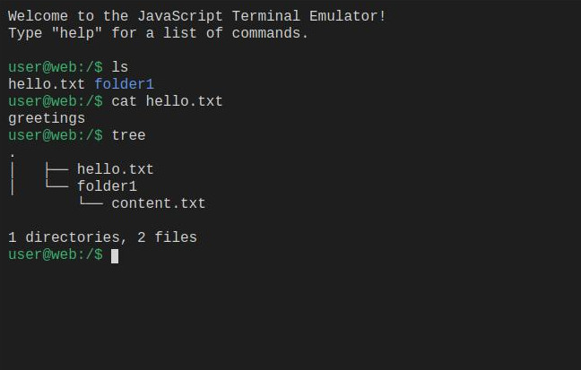

# JavaScript Terminal Emulator

This project is a browser-based terminal emulator written in JavaScript, HTML, and CSS. It mimics a command-line interface with basic file system functionality, allowing users to run commands like `ls`, `cd`, `mkdir`, `touch`, `cat`, and more. This terminal emulator provides an interactive experience similar to a Unix-like terminal directly within a webpage.

### Screenshot


## Features

- **File System Simulation**: Includes commands for file and directory management (`ls`, `cd`, `mkdir`, `touch`, `cat`, etc.).
- **Command History**: Navigate through previous commands using the arrow keys.
- **Autocomplete**: Press `Tab` to autocomplete file and directory names.
- **Tree View**: Display the file structure with the `tree` command.
- **Help Command**: Lists available commands with `help`.
- **Persistence**: Uses `localStorage` to save the file system state between sessions.

## Available Commands

- `ls`: List directory contents.
- `cd [path]`: Change the current directory.
- `mkdir [name]`: Create a new directory.
- `touch [name]`: Create a new file.
- `cat [filename]`: Display the contents of a file.
- `echo [message]` or `echo [message] > [file]`: Print a message to the terminal or write to a file.
- `rm [name]`: Remove files or directories.
- `clear`: Clear the terminal screen.
- `tree`: Display the directory structure in a tree format.
- `help`: Show a list of all available commands.

## How It Works

The terminal emulator uses JavaScript to:
- **Parse User Input**: Listens for keystrokes, processes command history, and provides feedback.
- **Simulate a File System**: Implements a hierarchical structure that mimics a Unix-like file system.
- **Display Output**: Outputs the command results and file system changes on the web page.

## Getting Started

1. Clone this repository:
   ```bash
   git clone https://github.com/your-username/your-repo-name.git
